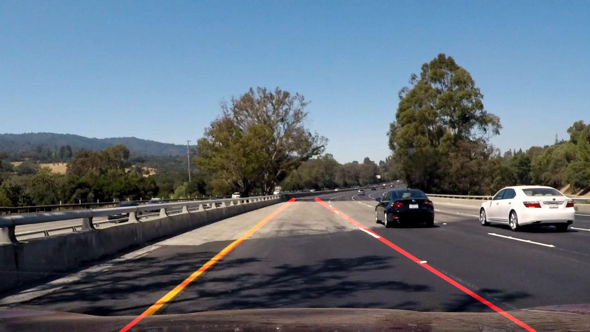

 
**Term 1 Project 1:** 
**Finding Lane Lines on the Road** 

---

This is my solution for the first project for term 1 of the Udacity Self Driving Car Engineer program. My writeup can be found [here](https://github.com/alangordon258/SelfDrivingCar-Term1-Proj1/blob/master/writeup_alangordon.md). The Jupyter Notebook with my solution can be found [here](https://github.com/alangordon258/SelfDrivingCar-Term1-Proj1/blob/master/P1.ipynb).  Test video outputs can be found [here](https://github.com/alangordon258/SelfDrivingCar-Term1-Proj1/tree/master/test_videos_output). I have included images showing what the detected lines looked like before modifying the draw_lines function [here](https://github.com/alangordon258/SelfDrivingCar-Term1-Proj1/tree/master/result_images_original_drawlines). I have also included images showing what the results look like after modifying the draw_lines function but before applying a filter to remove spurious lines which improved the behavior with the challenge video. These can be found [here](https://github.com/alangordon258/SelfDrivingCar-Term1-Proj1/tree/master/result_images_modified_drawlines_without_filter).

